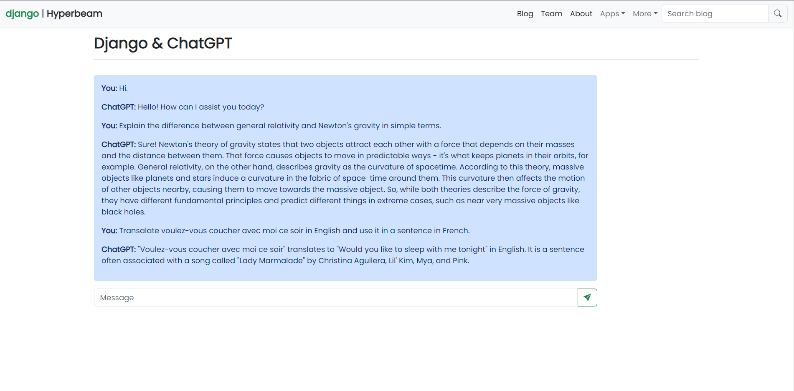
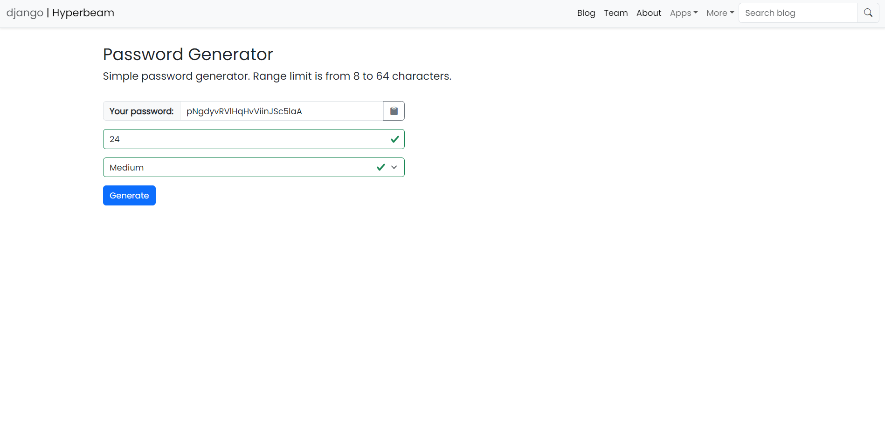

# Django-Hyperbeam
<!-- A collection of basic Django web applications for beginners. -->

## About

A collection of basic Django web applications that provides a solid foundation for those who are starting their journey in web development using Django. This collection includes various simple applications that help beginners understand the core concepts of Django and how to build web applications with this framework. 

Basic applications ie., Blog, Poll outlined in the [Django documentation](https://docs.djangoproject.com/en/4.2/intro/tutorial01/#writing-your-first-django-app-part-1).


---

## Applications
- Blog
- Polls
- Feedbacks/Contact Us
- Custom user profile
- ChatGPT
- Password Generator
---
## Prerequisites
- [Python 3.10.8 or later](https://www.python.org/downloads/)
- [PostgreSQL database (version 11 or later)]((https://www.postgresql.org/download/))
- [Django 4.0 or later](https://www.djangoproject.com/download/)
- [Git](https://git-scm.com/)
- <details>
    <summary>Web browser</summary>

  - [Chrome](https://www.google.com/intl/en_ph/chrome/)
  - [Firefox](https://www.mozilla.org/en-US/firefox/new/)
  - [Edge](https://www.microsoft.com/edge/download)
  - [Brave](https://brave.com/download/)

</details>

---

## Installation

1. Clone reporsitory.

```bash
$ git clone https://github.com/kitimi88/dj-hyperbeam.git
```

2. Setup virtual environment.

```bash
$ py -m venv .venv
$ .venv\scripts\activate
```
3. Upgrade pip (Whenever necessary).

```bash
$ py -m pip install --upgrade pip
```

4. Install required dependecies.

```bash
$ py -m pip install -r requirements.txt
```
5. Setup database and apply migration.

```bash
$ py manage.py makemigrations
$ py manage.py migrate
```

6. Start development server.

```bash
$ py manage.py runserver
```
**IMPORTANT** - Your preferred configuration should be defined in the [env.example.txt](./env.example.txt) and save it as ```.env``` in your main directory. Should you need a new SECRET_KEY, run the following:
```bash
$ py sskey_gen.py
```
---


## Note

This application may require the following packages:

| Package | Description |
| ------- | ----------- |
|[python-dotenv](https://pypi.org/project/python-dotenv/) |Read key-value pairs from .env file and set them as environment variables. In this sample app, those variables describe how to connect API. This package is used in the applications to load environment variables.|
|[OpenAI API](https://pypi.org/project/openai/) | Chatbot application requires integrating with an external API for natural language processing.
|[django-environ](https://pypi.org/project/django-environ/) | Allowing users use Twelve-factor methodology to configure your Django application with environment variables.
|[Bootstrap](https://getbootstrap.com/)| For fast and simple yet powerful web design.

---
## References and documentations

* [Django](https://docs.djangoproject.com/en/4.1/)
* [Bootstrap](https://getbootstrap.com/)
* [PostgreSQL](https://www.postgresql.org/download/)
* [Git for Windows](https://gitforwindows.org/)
* [Openai (API Reference)](https://platform.openai.com/docs/api-reference)
* [Django with PostgreSQL in Azure](https://learn.microsoft.com/en-us/azure/app-service/tutorial-python-postgresql-app?tabs=flask%2Cwindows&pivots=deploy-portal)

---
## Screenshots






---
## Contributions
_Pending contribution guide._
***
## License
[MIT License](./LICENSE)

---
Check out my other [respository](https://github.com/kitimi88?tab=repositories) for more python projects.

